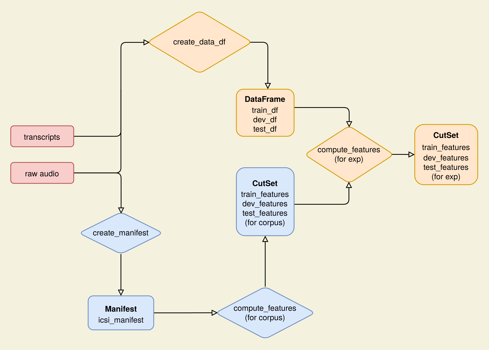

### A Machine Learning Pipeline for Laughter Detection on the ICSI Corpus

This repo is based on the laughter detection model by [Gillick et al.](https://github.com/jrgillick/laughter-detection) and retrains it on the
[ICSI Meeting corpus](https://ieeexplore.ieee.org/abstract/document/1198793)

The data pipeline uses [Lhotse](https://github.com/lhotse-speech/lhotse), a new Python library for speech and audio data preparation.

This repository consists of three main parts:
1. Evaluation Pipeline
2. Data Pipeline
3. Training Code

The following list outlines which parts of the repository belong to each of them and classifies the parts/files as one of three types:
1. `from scratch`: entirely written by myself
2. `adapted`: code taken from [Gillick et al.](https://github.com/jrgillick/laughter-detection) and adapted
3. `unmodified`: code taken from [Gillick et al.](https://github.com/jrgillick/laughter-detection) and not adapted or modified

- **Evalation Pipeline** (from scratch): 
    - `analysis`
        - `transcript_parsing/parse.py` +`preprocess.py`: parsing and preprocessing the ICSI transcripts
        - `analyse.py`: main function, that parses and evaluates predictions from .TextGrid files output by the model
        - `output_processing`: scripts for creating .wav files for the laughter occurrences to manually evaluate them
    - `visualise.py`: functions for visualising model performance (incl. prec-recall curve and confusion matrix)

- **Data Pipeline** (from scratch) - also see [diagram](#diagram-of-the-data-pipeline):
    - `compute_features`:  computes feature representing the whole corpus and specific subsets of the ICSI corpus
    - `create_data_df.py`: creates a dataframe representing training, development and test-set 

- **Training Code**:
    - `models.py` (unmodified): defines the model architecture
    - `train.py` (adapted): main training code
    - `segment_laughter.py` + `laugh_segmenter.py` (adpated): inference code to run laughter detection on audio files
    - `datasets.py` + `load_data.py` (from scratch): the new LAD (Laugh Activity Detection) Dataset + new inference Dataset and code for their creation

- **Misc**:
    - `Demo.ipynb` (from scratch): demonstration of using Lhotse to compute features from a dataframe defining laughter and non-laughter segments 
    - `config.py` (adapted): configurations for different parts of the pipeline
    - `results.zip` (N/A): contains the model predictions from experiments presented in my thesis
### Diagram of the Data Pipeline

